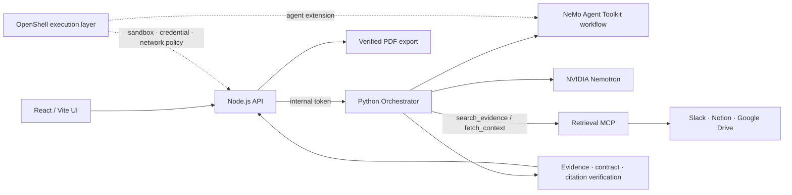

# HandoffOS

### 분산된 조직 기록을 검증 가능한 업무 맥락으로 전환하는 Agentic Workflow

HandoffOS는 Slack, Notion, Google Drive에 흩어진 기록을 탐색하고, 근거와 함께 업무의 맥락을 구조화하는 온보딩·인수인계 플랫폼입니다. 새 구성원이 문서를 찾는 데서 멈추지 않고, **무엇을 해야 하는지, 누구에게 확인해야 하는지, 어떤 근거를 따라야 하는지**를 빠르게 파악하도록 돕습니다.

## 문제: 온보딩 정보는 많지만, 업무 맥락은 전달되지 않습니다

온보딩은 새 구성원이 조직의 업무 방식과 협업 맥락을 익히고 성과를 내기 시작하는 첫 단계입니다. 하지만 실제 정보는 여러 문서와 대화에 나뉘어 있고, 담당자마다 전달 방식과 품질이 다릅니다.

- 업무 절차, 담당자, 일정, 선행 업무가 서로 다른 문서에 흩어져 있습니다.
- 문서 작성자나 최근 수정 시각만 보고 담당자와 일정을 잘못 추정하기 쉽습니다.
- 상충하는 정책과 누락된 정보가 있어도, 새 구성원은 무엇을 누구에게 확인할지 알기 어렵습니다.

HandoffOS는 단순 요약 대신 업무 단위로 정보를 연결합니다. 근거를 다시 확인하는 제한된 agent loop를 통해 업무, 담당자, 절차, 일정, 의존관계와 확인 질문을 한 화면의 실행 가능한 가이드로 만듭니다.

## 해결 방식

```text
흩어진 기록                         검증된 업무 맥락                        실행 가능한 온보딩

Slack · Notion · Drive  ──►  근거 탐색 · 재검토 · 충돌 보존  ──►  Task Contract · 체크리스트 · 확인 질문
```

1. **업무 단위 구조화**: 여러 출처의 정보를 업무, 담당자, 절차, 일정, 완료 조건, 의존관계로 연결합니다.
2. **근거 검증 루프**: 검색, 다음 페이지 탐색, 원문 재검토, 완료의 제한된 흐름으로 필요한 근거를 수집하고 검증합니다.
3. **불확실성 공개**: 확인되지 않은 담당자·일정은 추측하지 않고 `확인 필요` 질문으로 남깁니다. 서로 다른 근거는 비교해 보여 줍니다.
4. **업무 재사용**: 생성한 Task Contract와 확인 질문은 온보딩뿐 아니라 인수인계, FAQ, 운영 가이드 갱신의 입력으로 사용할 수 있습니다.

## NVIDIA AI Hackathon 평가 기준에 대한 구현

### 1. NVIDIA Agent 기술 활용 심도

- **NeMo Agent Toolkit(NAT)**: 같은 Python Orchestrator를 NAT custom function으로 등록하고, `HANDOFF_WORKFLOW_RUNTIME=nat` 환경에서 WorkflowBuilder 경로로 실행합니다.
- **Nemotron adapter**: NVIDIA Chat Completions API와 모델별 tokenizer를 이용해 검색·재검토·완료 결정을 위한 구조화된 JSON 출력을 처리합니다.
- **Retrieval MCP**: Slack, Notion, Google Drive를 읽기 전용으로 검색하는 MCP 도구 `search_evidence`, `fetch_context`를 제공합니다. Orchestrator는 Streamable HTTP MCP에 직접 연결합니다.
- **Bounded verification loop**: 검색 횟수, 원문 재검토, 문서 수, 토큰, 실행 시간을 제한하고, Evidence/RetrievalResponse 계약과 인용을 검증합니다.

### 2. 실용성, 산업 가치, 혁신성

- 신규 입사자 온보딩과 팀 내 인수인계에 반복되는 정보 탐색 비용을 줄입니다.
- 정책이 충돌하거나 정보가 비어 있는 경우, 확정된 사실처럼 생성하지 않고 의사결정권자에게 확인할 질문을 제시합니다.
- 반복 질문은 출처 기반 답변과 업무 가이드로 축적할 수 있어 조직 지식의 품질을 점진적으로 높입니다.
- 동아리 총무, 운영팀, 백오피스처럼 비정형 문서와 대화가 많은 조직부터 적용할 수 있고, 기업 온보딩·운영 지식 관리로 확장할 수 있습니다.

### 3. 완성도

- React/Vite UI, Node.js 공개 API, Python Orchestrator, Retrieval MCP, PDF export를 하나의 로컬 실행 경로로 제공합니다.
- 공개 API는 `/v1`의 12개 operation을 유지하며, `apps/web/openapi.yaml`을 단일 원본으로 사용합니다.
- 고정된 Evidence/RetrievalResponse 계약, Python 계약·agent-loop 테스트, Node ACL 테스트, 웹 production build를 포함합니다.
- 체크리스트 상태와 진행률은 서버가 관리하며, 생성 중 오류가 발생해도 이전에 생성한 콘텐츠를 보존합니다.

### 4. 커스터마이징과 독창성

- 역할, 팀, 모델, retrieval 방식, runtime을 환경 변수로 분리해 조직별 실행 환경을 구성합니다.
- 문서의 author/owner를 업무 담당자로, retrieval/update timestamp를 업무 기한으로 자동 추론하지 않습니다.
- 근거가 없는 정보는 `null` 또는 확인 질문으로 남기고, 상충하는 근거를 하나의 결론으로 덮어쓰지 않습니다.
- 다른 agent가 업무를 수행할 때도 검증된 업무 명세와 제약조건을 재사용할 수 있도록 설계했습니다.

## 시스템 구조



| 계층 | 책임 |
| --- | --- |
| React/Vite UI | 온보딩 섹션, 체크리스트, 충돌 비교, 질문·출처 표시 |
| Node.js API | JWT 인증, job 상태, 진행률, 체크리스트, HTTP 콘텐츠 ACL 재검증 |
| Python Orchestrator | 읽기 전용 retrieval, 제한된 합성 루프, Task Contract와 답변 생성, 근거 검증 |
| NVIDIA Agent layer | NAT workflow, Nemotron structured-output adapter, Retrieval MCP 도구 |
| OpenShell execution layer | agent와 분리된 sandbox, credential, network access 정책을 적용하는 확장 실행 계층 |

OpenShell은 특정 agent에 업무 구조화·retrieval·검증 로직을 결합하지 않기 위한 실행 아키텍처입니다. Hermes, OpenClaw 등 OpenShell 지원 agent로 확장할 수 있도록 설계했으며, 현재 앱의 검증 로직 자체와는 분리된 배포·실행 계층입니다.

## 실제 사용 예시: 동아리 총무 인수인계

총무가 “벌점은 어떻게 처리해?”, “법인세 납부는 어떻게 해?”, “MT 준비는 언제 시작해?”라고 질문합니다.

1. HandoffOS가 Slack 대화, Notion 회의록, Drive 내규·운영 시트를 검색합니다.
2. 출석·벌점 처리, 세무 처리, MT 준비 절차를 각 업무의 담당자·기한·완료 조건·근거와 함께 정리합니다.
3. 최신 Slack 대화와 기존 문서가 다르면 두 근거를 모두 제시하고, 최종 정책을 확인할 사람과 질문을 남깁니다.
4. 총무는 출처를 열어 원문을 검토하고, 체크리스트로 준비 상태를 관리합니다.

## 온보딩 이후의 확장

HandoffOS는 온보딩에서 시작하지만, 검증된 업무 맥락을 조직 운영에 재사용하는 기반을 지향합니다.

- **업무 준비도 점검**: 담당자, 기한, 완료 조건, 선행 업무의 누락을 확인합니다.
- **조직 지식 갱신**: 충돌하는 문서와 반복 질문을 모아 수정할 문서와 확인할 담당자를 제시합니다.
- **범용 agent 실행 입력**: 검증된 Task Contract와 제약조건을 후속 agent의 안전한 업무 수행 입력으로 제공합니다.

## 실행

### 요구 사항

- Node.js 22.12 이상
- Python 3.11 이상
- Windows PowerShell 기준

먼저 Retrieval MCP를 같은 PC에서 실행합니다. 해당 서비스의 `.env`에는 Slack·Notion·Drive 읽기 전용 credential을 둡니다.

```powershell
cd services/retrieval-mcp
Copy-Item .env.example .env
uv sync
uv run --env-file .env retrieval-mcp
```

다른 터미널에서 저장소 루트로 돌아와 HandoffOS를 실행합니다.

```powershell
python -m venv .venv
.venv/Scripts/python.exe -m pip install -r requirements-lock.txt
npm.cmd ci --prefix services/api
npm.cmd ci --prefix apps/web
node scripts/dev.mjs
```

브라우저에서 [http://127.0.0.1:5173](http://127.0.0.1:5173)을 엽니다. UI는 `5173`, 공개 API는 `8787`, 내부 Python worker는 `8788` 포트를 사용하며 모두 loopback에 바인딩됩니다.

## 환경 변수

루트의 `.env`가 있으면 `scripts/dev.mjs`가 이를 읽어 UI, Node API, Python worker에 전달합니다. `.env.example`을 복사해 조직 환경에 맞춰 설정하고, 비밀 값은 Git에 커밋하지 마세요.

```powershell
Copy-Item .env.example .env
```

| 목적 | 주요 환경 변수 | 실행 조건 |
| --- | --- | --- |
| Retrieval MCP | `HANDOFF_RETRIEVAL_MODE=mcp`, `RETRIEVAL_MCP_URL`, `RETRIEVAL_MCP_TOKEN` | Streamable HTTP MCP endpoint가 필요하며, 로컬 기본 URL은 `http://127.0.0.1:8000/mcp` |
| NVIDIA Nemotron 추론 | `HANDOFF_MODEL_MODE=nemotron`, `NVIDIA_API_KEY`, `NVIDIA_MODEL`, `NVIDIA_TOKENIZER_PATH` | API 키와 선택 모델에 맞는 tokenizer 경로가 모두 필요 |
| NAT workflow | `HANDOFF_WORKFLOW_RUNTIME=nat`, `HANDOFF_PYTHON` | NAT가 설치된 지원 Python 환경 필요 |
| HTTP retrieval adapter | `HANDOFF_RETRIEVAL_MODE=http`, `HANDOFF_RETRIEVAL_URL`, `HANDOFF_RETRIEVAL_TOKEN` | `/search` 형식 adapter와 `HANDOFF_ACCESS_URL` ACL 검증 endpoint 필요 |
| 로컬 사용자 문맥 | `HANDOFF_USER_ID`, `HANDOFF_TEAM_ID`, `HANDOFF_ROLE` | 역할과 팀별 온보딩 문맥 설정 |

`HANDOFF_RETRIEVAL_MODE=mcp`에서는 Orchestrator가 `RETRIEVAL_MCP_URL`의 `/mcp` endpoint에 직접 연결합니다. 원격·sandbox 배포에서는 Retrieval MCP를 private TLS endpoint와 인증·사용자별 ACL 정책 뒤에 두어야 합니다.

NVIDIA/NAT 설정 상세는 [NVIDIA runtime 안내](docs/nvidia-runtime.md), provider별 OAuth 설정은 [Retrieval MCP README](services/retrieval-mcp/README.md), OpenShell 배포 전제는 [OpenShell 배포 안내](docs/openshell-deployment.md)를 참고하세요.

## 검증

```powershell
.venv/Scripts/python.exe -m pytest -q
node --test services/api/access.test.mjs services/api/timeouts.test.mjs
npm.cmd run build --prefix apps/web -- --emptyOutDir=false
```

PDF는 검증된 워크스페이스 콘텐츠에서 생성합니다.

```powershell
$env:PYTHONPATH='services/orchestrator'
.venv/Scripts/python.exe -m handoff.export_pdf --user-id kim-juhyung
```

## 문서

- [제품 명세](docs/product-spec.md)
- [아키텍처](docs/architecture.md)
- [API 명세](docs/api-spec.md)
- [데이터 계약](docs/data-contract.md)
- [NVIDIA/NAT 실행 안내](docs/nvidia-runtime.md)
- [Retrieval MCP와 NeMoTron 연동](docs/neomotron-retrieval-mcp.md)
- [OpenShell 배포 안내](docs/openshell-deployment.md)
- [3분 데모 시나리오](docs/demo-script.md)
- [검증 기록](docs/verification.md)

## 저장소 구성

```text
apps/web/                 React/Vite 온보딩 UI와 OpenAPI 원본
services/api/             Node.js 공개 API, 인증·ACL 경계
services/orchestrator/    Python 합성 엔진, 검증, PDF export
services/retrieval-mcp/   Slack·Notion·Google Drive 읽기 전용 MCP
packages/contracts/       Evidence/RetrievalResponse 계약
docs/                     제품, 아키텍처, 운영 문서
```
