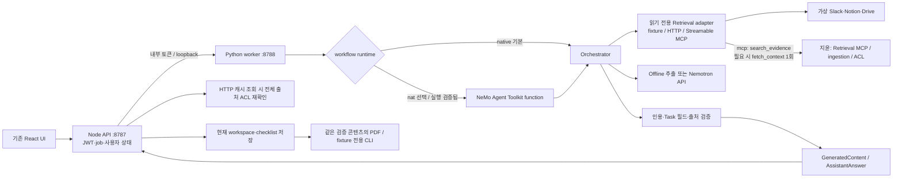
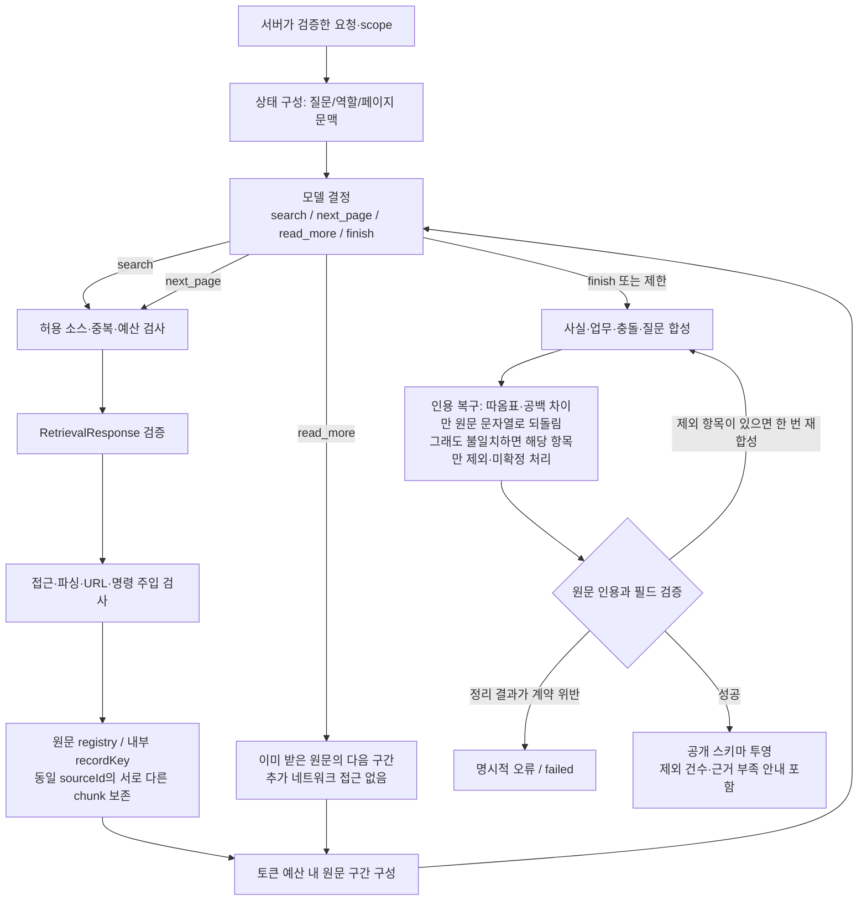
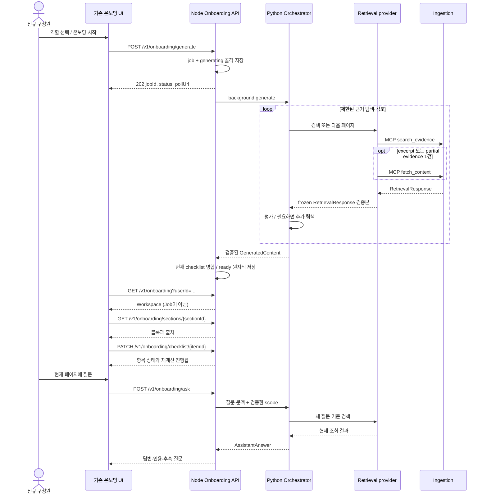

# HandoffOS MVP 구조와 에이전트 루프

## 시스템 경계

루프는 **Python Orchestrator 내부**에서만 수행합니다. FE polling이나 cron이 에이전트 추론 루프가 아닙니다. Node는 HTTP 계약·인증·job·완료 상태를 담당하며 LLM이 완료율을 결정하지 않습니다. 소스별 독립 추론 에이전트는 만들지 않습니다.

## 요청 중 실행되는 루프

명령 주입 정규식은 탐지 보조 수단이며 완전한 탐지기를 의미하지 않습니다. 핵심 보안 경계는 소스 텍스트가 시스템 지시가 되지 않는 메시지 구조, 서버 scope 고정, 그리고 **외부 쓰기/임의 URL 방문/코드 실행 도구 자체가 없는 것**입니다. 현재 모델 제공자로 보내는 접근 가능한 텍스트는 배포 설정으로 승인된 정보여야 합니다.

## 사용자 제공 시퀀스 준수

generate는 자료 검색을 끝낸 뒤 202를 주는 방식이 아닙니다. 먼저 접수하고 background 실행합니다. ask는 동기 실행입니다.

## 예산과 중단

| 항목 | generate | ask |
|---|---:|---:|
| 검색/다음 페이지 총 횟수 | 최대 8 | 최대 4 |
| 저장 원문 다음 구간 검토 | 최대 2 | 최대 1 |
| 후보 원문 | 최대 64 | 최대 40 |
| 모델에 동시에 넣는 원문 | 최대 24 (검색별로 번갈아 배치) | 최대 24 (검색별로 번갈아 배치) |
| MCP `fetch_context` 확장 | 적중 블록 주변 최대 12개 | 같음 |
| Python 실행 제한 (`HANDOFF_*_TIMEOUT_SECONDS` 기본값) | 360초 | 180초 |
| 새 검색 시작 마감 | 200초 (제한 − 160초, 최소 절반) | 110초 (제한 − 70초, 최소 절반) |
| Node 요청 제한 | Python 제한 + 15초 | Python 제한 + 15초 |
| 브라우저 ask 요청 제한 | — | Node 제한 + 15초 |
| 인용 검증 재합성 | 최대 1 | 최대 1 |

모델은 이전 검색어와 남은 검색 횟수를 보고, 원문이 가리키는 다른 문서·채널·규정 같은 단서가 있으면 새 키워드로 다시 검색합니다(2026-09-28 실제 Nemotron이 검색 1회 후 종료해 늘림). 넓은 첫 검색의 결과가 나중 검색 결과를 모델 입력에서 밀어내지 않도록 검색별로 번갈아 배치합니다. 마감 이후에는 새로운 탐색을 시작하지 않고 합성으로 넘어갑니다. 시간 초과 시 성공으로 위장하지 않습니다. tokenizer는 live 모델에 맞는 실제 파일을 사용하며 전체 프롬프트/출력 여유도 다시 검사합니다.

## 코드 위치

- `services/orchestrator/handoff/engine.py`: 상태·선택·제한·원문 registry.
- `contracts.py`: 확정 입력 및 내부 합성 타입.
- `providers.py`: Fixture/HTTP/Streamable-MCP retrieval 경계. MCP 도구·응답의 불일치가 공개 API로 새지 않도록 contract validation과 scope 검사를 수행한다.
- `models.py`: offline 기준선 / Nemotron JSON 결정·합성.
- `projection.py`, `entities.py`: 인용·Task 관계·인물·일정 검증과 공개 응답 변환.
- `api.py`: 내부 인증·worker 진입점.
- `nat_workflow.py`: 선택적 NAT 등록 및 호출.
- `services/api/server.mjs`: 기존 공개 API 구현.
- `export_pdf.py`: 저장된 콘텐츠의 PDF 변환.

NemoClaw은 이 MVP의 필수 런타임이 아니다. 현재 준비한 OpenShell 배포 경계·실행 계획은 [`openshell-deployment.md`](openshell-deployment.md)에 있으며, OpenShell Gateway/Sandbox 실제 실행은 호스트 요건을 갖춘 뒤에만 주장한다. 기본 로컬 경계가 OpenShell 샌드박스와 동등하다고 주장하지 않습니다.
