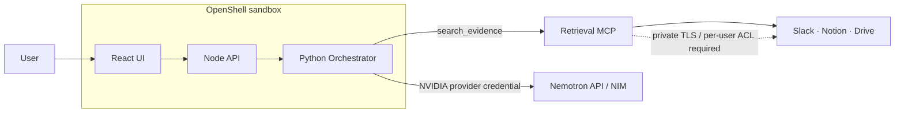

# OpenShell 배포·NemoClaw 범위 계획

## 2026-09-28 현재 상태

| 항목 | 상태 | 근거 / 다음 조치 |
|---|---|---|
| `main` 기준 | 준비됨 | `5164c37`에는 Orchestrator와 Retrieval MCP가 모두 병합됨 |
| 통합 branch | 진행 중 | `feat/agent-retrieval-integration`: MCP Provider·테스트·OpenShell 파일 추가 |
| Retrieval MCP 연결 | 검증됨 | local Streamable HTTP 연결, `search_evidence`/`fetch_context` 실제 호출. source OAuth 없음은 `missing_credentials`로 분리 |
| NVIDIA 모델 HTTP adapter | mock 계약 검증됨 | 실제 `NVIDIA_API_KEY`·선택 model tokenizer가 없으므로 live inference는 미검증 |
| OpenShell CLI/gateway/sandbox | 호스트 차단 | 이 Windows 호스트에는 Linux WSL 배포판, Docker, `openshell` CLI가 없음 |
| NemoClaw | 범위 밖 | HandoffOS는 custom Orchestrator; NemoClaw/OpenClaw blueprint 설치·실행을 주장하지 않음 |

## 최종 구조

HandoffOS sandbox에는 Slack·Notion·Drive credential을 넣지 않는다. 그 credential은 Retrieval MCP 서비스에만 두며, Orchestrator sandbox는 policy가 허용한 MCP endpoint와 NVIDIA endpoint에만 연결한다. MCP는 현재 read-only이나 인증 미구현이므로, 원격 배포 때는 private TLS endpoint와 인증/ACL bridge가 선행 조건이다.

## 팀 역할 기준 실행 순서

1. **민성 (이 branch)**: main에서 `feat/agent-retrieval-integration`을 만들고, MCP Provider의 `search_evidence`·조건부 `fetch_context`·scope/contract 검증과 Nemotron request contract를 테스트한다.
2. **지윤 (Retrieval)**: Streamable MCP URL, OAuth credential 보관 위치, 사용자별 ACL의 enforcement point, TLS/인증 방식, production source ID 규칙을 확정한다.
3. **민성 + 지윤**: 실제 source credential이 있는 staging에서 `ok`, `empty`, `partial`, `failed`, excerpt→context 각각 1회 검증한다. `RETRIEVAL_MCP_URL`은 sandbox에서 도달 가능한 TLS DNS여야 한다.
4. **OpenShell host 담당**: Gateway와 compute driver(Docker/Podman/Kubernetes)를 준비한 뒤 `deploy/openshell` 절차로 sandbox를 만든다.
5. 검증 커밋을 push한 뒤 sandbox가 해당 branch/commit만 clone하도록 `HANDOFF_GIT_REF`와 `HANDOFF_EXPECTED_COMMIT`을 지정한다. sandbox 내부에서 별도 수정/commit/push는 하지 않는다.

## API·루프 정합성

- FE는 기존 `POST /v1/onboarding/generate`와 `POST /v1/onboarding/ask`만 사용한다. `/v1` OpenAPI 12개 operation은 변경하지 않는다.
- Node는 JWT·job·checklist·workspace 상태만 담당한다. Python Orchestrator만 `search`, `next_page`, `read_more`, `finish`을 선택한다.
- `search`와 `next_page`는 MCP `search_evidence`로, `read_more`는 이미 받은 원문의 다음 local window로 이어진다.
- `fetch_context`는 4개 모델 action 중 하나가 아니다. 반환된 evidence가 excerpt/partial일 때 Provider가 전체 근거를 검증하려는 제한된 보강 호출이며, 한 요청에 한 번만 허용된다.
- MCP 경계는 frozen `Evidence`/`RetrievalResponse`만 Orchestrator로 전달한다. snapshotId, evidenceId, locator, parentSourceId를 요구하지 않는다.

## Go / no-go 체크리스트

### merge 전에 이 branch에서 완료

- [x] branch base가 merged main `5164c37`
- [x] MCP URL은 HTTPS 또는 loopback HTTP만 허용
- [x] `search_evidence` 호출과 contract/scope validation 테스트
- [x] excerpt/partial에 한해 `fetch_context` 한 번 호출 테스트
- [x] partial coverage enum adaptation, context 실패의 partial 보존 테스트
- [x] Nemotron JSON request/재시도 테스트
- [ ] 실제 MCP source OAuth와 per-user ACL staging 테스트 (지윤과 공동)
- [ ] 실제 NVIDIA key·모델·matching tokenizer로 live generate/ask (민성)

### OpenShell sandbox를 만들기 전에

- [ ] WSL2 Linux 또는 지원 Linux host, Docker/Podman/Kubernetes driver, OpenShell CLI/gateway가 `openshell status`에서 healthy
- [ ] `openshell policy prove`가 deployment policy를 통과
- [ ] NVIDIA provider가 endpoint-bound credential로 ready
- [ ] Retrieval MCP의 private TLS endpoint와 authentication/ACL이 ready
- [ ] selected Nemotron tokenizer가 image의 read-only path에 배포됨

### sandbox 생성 뒤

- [ ] `openshell policy get handoffos-mvp --full`로 effective policy 확인
- [ ] public repository clone이 지정된 commit과 일치
- [ ] offline+fixture UI smoke test
- [ ] MCP mode에서 `search_evidence`/필요 시 `fetch_context` audit event 확인
- [ ] live NVIDIA generate/ask 응답 및 citations 검토
- [ ] sandbox log에 `action=deny`가 없는지, provider secret 값이 출력되지 않는지 점검

## 남은 의사결정

1. Retrieval MCP를 OpenShell sandbox와 같은 private network에 둘지, authenticated TLS gateway 뒤에 둘지 결정해야 한다. `localhost`는 다른 sandbox에서 가리키면 안 된다.
2. MCP endpoint authentication의 token/OAuth/mTLS 방식과 사용자 identity forwarding을 지윤님과 확정해야 한다. 현재 `RETRIEVAL_MCP_TOKEN`은 client 준비 변수일 뿐 server enforcement는 아니다.
3. NVIDIA 모델 ID와 정확히 일치하는 `tokenizer.json`의 image 경로/배포 담당을 확정해야 한다.
4. NemoClaw을 별도 데모로 사용할지 결정한다. 사용할 경우에도 HandoffOS Orchestrator 대신 NemoClaw agent가 write tool을 얻지 않도록 policy·승인 절차를 별도 설계한다.
